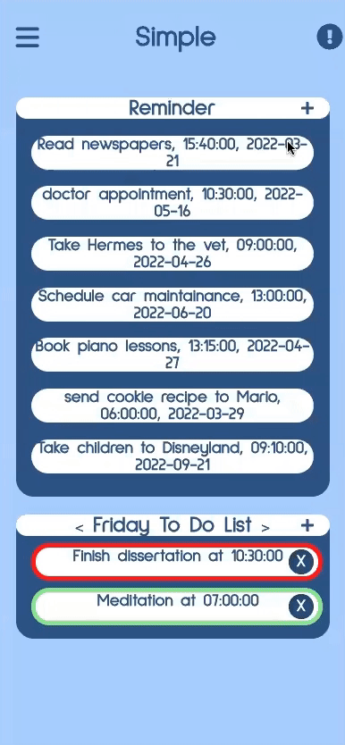
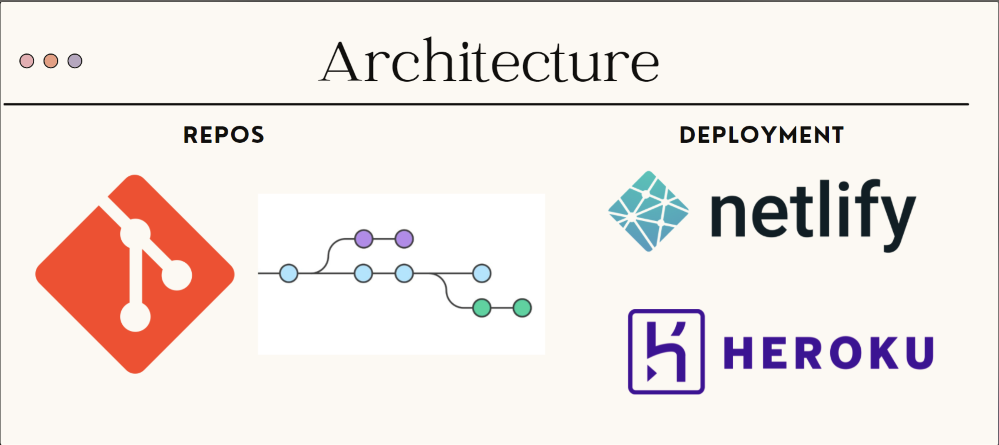
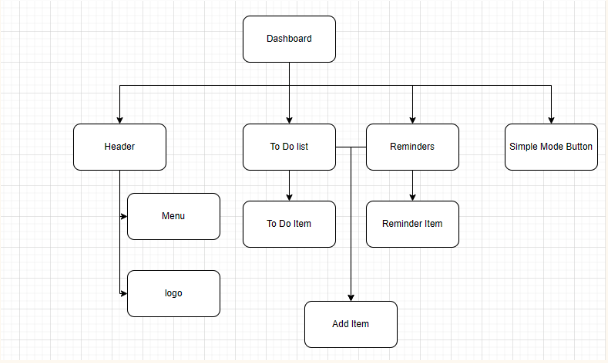

<h1 align = "center"> ☮️ SIMPLE ☮️</h1>

**Table of Contents**
1. [Summary](#{Summary}) 
2. [Architecture](#{Architecture})
3. [Components](#{Components})
3. [Tools](#{Tools})

## Demo

  
  

## Summary
Wellness and productivity apps are the key tools in most people's lives; however, most apps in the market are often overwhelming for many people who are neuro-divergent.

## Architecture
 
  
## Components 

 

## Tools 

  

  

  
  

  
